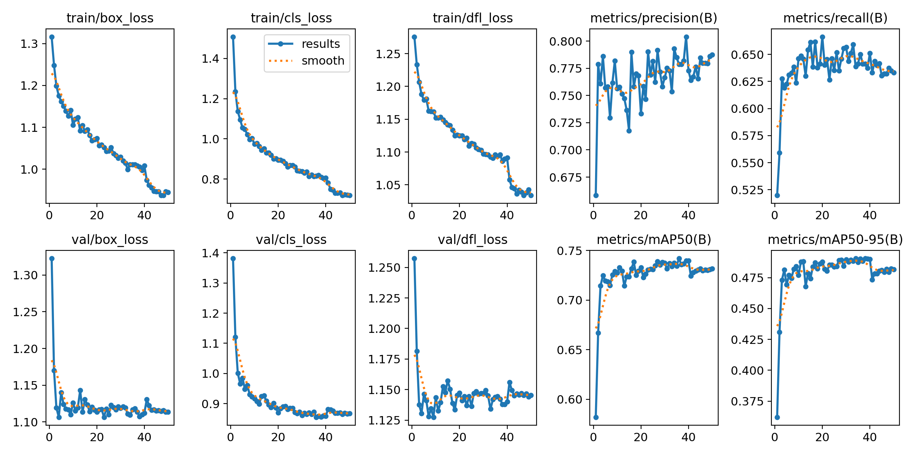

# Person Detection using YOLOv11 and YOLOv11n

This project explores object detection focused on detecting **persons** in images using the YOLOv11 and YOLOv11n architectures.

## 📁 Repository Structure

- `Train/yolo11.ipynb`: Training notebook for YOLOv11.
- `Train/yolo11n.ipynb`: Training notebook for YOLOv11n (lightweight model).
- `Train/tensorboard.ipynb`: View training logs and metrics with TensorBoard.
- `Inference/yolo11/person_counter.ipynb`: Inference test with a sample video.
- `Person detection.pptx`: Summary and conclusion of the experiment

---

## 🔧 Step-by-Step Guide

### ✅ Step 1: Train the Models

Run the following notebooks:

```bash
Train/yolo11n.ipynb
Train/yolo11.ipynb
```

### ✅ Step 2: View Evaluation Metrics

Once training is complete, visualize the training and validation metrics:

```bash
Train/tensorboard.ipynb
```

This will help you compare precision, recall, mAP, and loss curves

### 📊 Results
#### 🧠 YOLOv11n (Lightweight Model)
##### Training vs Validation Accuracy per Epoch


##### Confusion Matrix


### 🧠 YOLOv11 (Full Model)
##### Training vs Validation Accuracy per Epoch


##### Confusion Matrix


### ✅ Step 3: Test Inference

Video sample for inference: `Inference/street.mp4`. Run the inference script:

```bash
Inference/yolo11/person_counter.ipynb
```

Result will be generated in the same folder
- `Inference/yolo11/output_person_detect_v1_street.mp4`: Inference result using yolo11n
- `Inference/yolo11/output_person_detect_v2_street.mp4`: Inference result using yolo11

### ✅ Step 4: Conclusion
Refer to `Person Detection.pptx` for summary and conclusion of this experiment 
